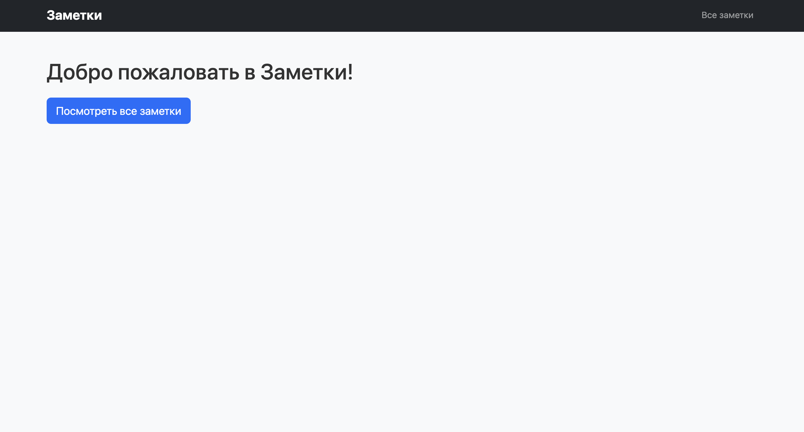
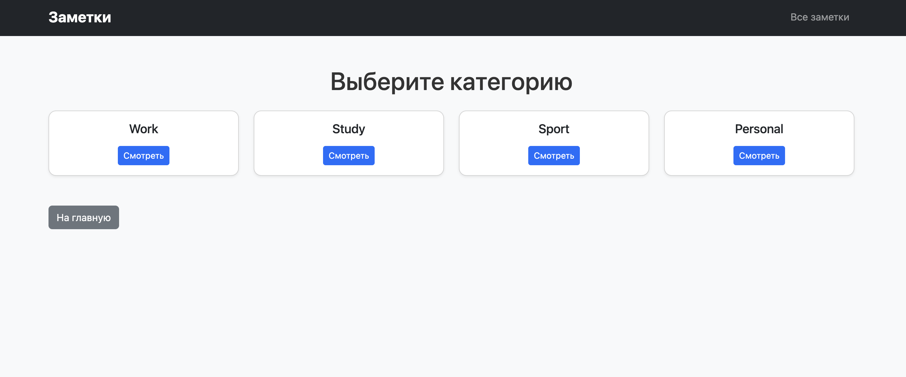
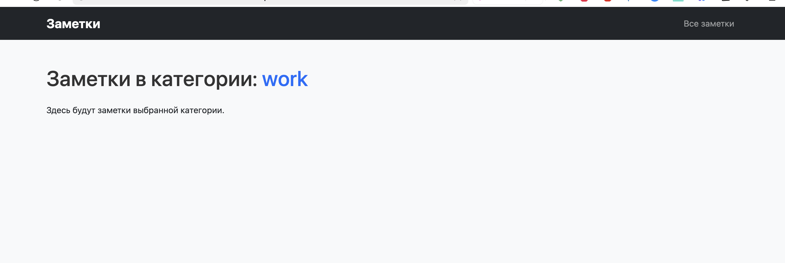

# 📝 Мини‑проект «Заметки» (Django)

Учебный мини‑проект на **Django**, демонстрирующий работу с маршрутами, view‑функциями, HTML‑шаблонами и Bootstrap.  
Проект реализует простое приложение для заметок с категориями и детальными страницами.

---

## 🚀 Функционал

- Главная страница приложения  
- Список всех заметок  
- Страница выбора категории с карточками  
- Список заметок по категории  
- Детальная страница заметки  
- Используются **HTML‑шаблоны** с **Bootstrap 5** и **кастомным CSS** через `static/`  

---

## 📂 Структура проекта

```

notebook\_project/
│── manage.py
│── notebook\_project/
│   ├── __init__.py
│   ├── settings.py
│   ├── urls.py
│   └── wsgi.py
│
├── notes/
│   ├── __init__.py
│   ├── urls.py
│   ├── views.py
│   ├── apps.py
│   ├── templates/notes/
│   │   ├── base.html
│   │   ├── home.html
│   │   ├── all\_notes.html
│   │   ├── category\_list.html
│   │   ├── category\_notes.html
│   │   └── note\_detail.html
│   └── migrations/
│
└── static/
└── notes/
└── css/
└── style.css

````

---

## ⚙️ Установка и запуск

1. **Клонируйте репозиторий**
   ```bash
   git clone <repo_url>
   cd notebook_project
    ````

2. **Создайте виртуальное окружение и активируйте его**

   ```bash
   python -m venv venv
   source venv/bin/activate  # macOS/Linux
   venv\Scripts\activate     # Windows
   ```

3. **Установите Django**

   ```bash
   pip install django
   ```

4. **Запустите сервер разработки**

   ```bash
   python manage.py runserver
   ```

5. **Откройте проект в браузере**

   * Главная страница приложения:
     `http://127.0.0.1:8000/notes/`
   * Список всех заметок:
     `http://127.0.0.1:8000/notes/all/`
   * Страница выбора категории:
     `http://127.0.0.1:8000/notes/category/`
   * Список заметок по категории:
     `http://127.0.0.1:8000/notes/category/work/`
   * Детальная заметка:
     `http://127.0.0.1:8000/notes/note/5/`

---

## 🖼 Скриншоты

Добавьте скриншоты страниц:

1. Главная

2. Все заметки

3. Страница категорий


4. Заметки по категории


5. Детальная заметка


---

## 📜 Лицензия

Проект создан в учебных целях. Свободно используйте его как шаблон для изучения **Django**.
